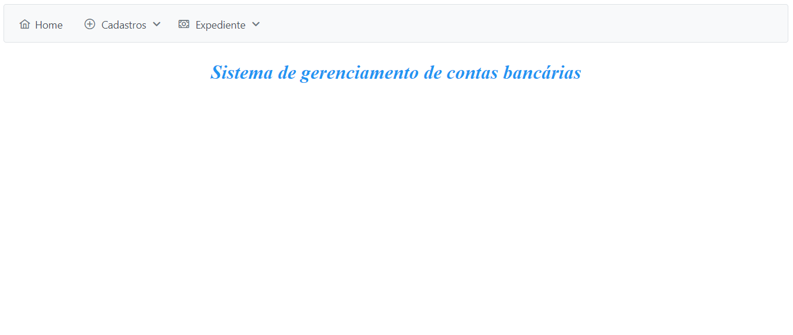
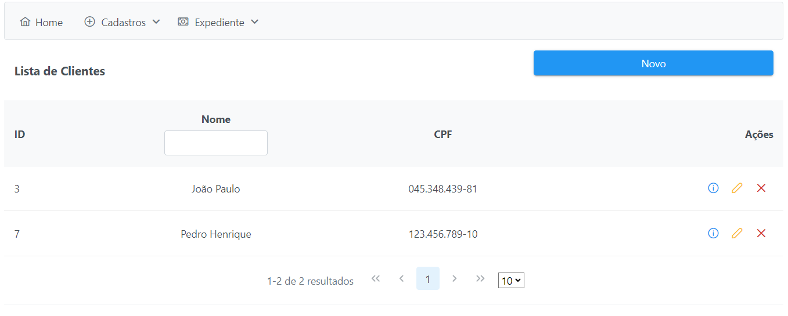
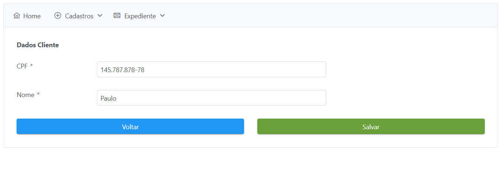
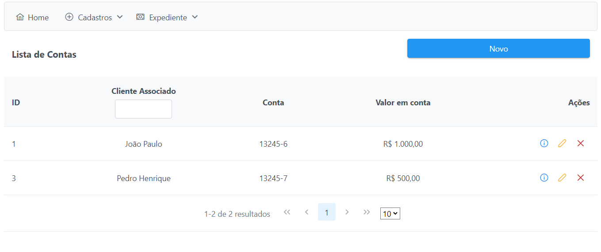
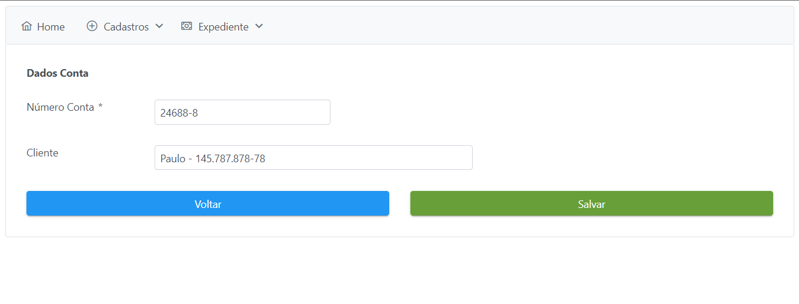
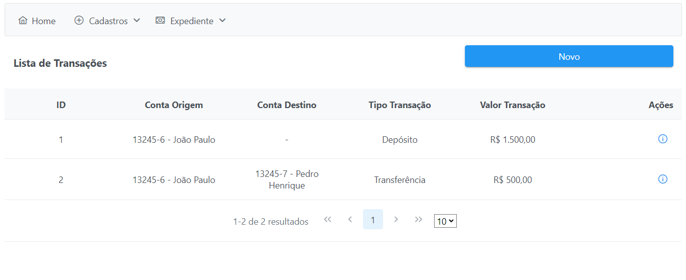
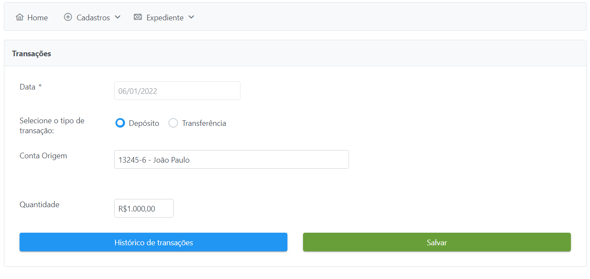
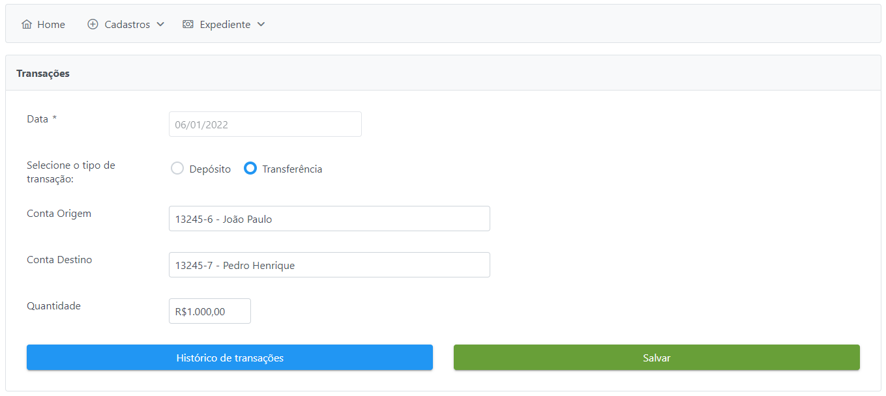

<h1 align="center">🏦 Sistema Bancário<h1>

## 🔖 Sobre

Aplicação de controle de contas e realização de depósitos e transferências. Permite realizar cadastro de clientes e
contas, sendo necessário associar um cliente a uma conta, para a realização de depósitos e transferências.

# 🖥️ Visualização

## 🏠 Página Inicial

    

## 📓 Lista Clientes

    

## 👤 Novo Cliente

    

## 📓 Lista Contas

    

## 🏦 Nova Conta

    

## 📓 Lista Transações

    

## 💵 Novo Depósito

    

## 💵 Nova Transferência

    

## 🚀 Tecnologias

- [Java](https://www.java.com/pt-BR/)
- [PrimeFaces](https://www.primefaces.org/showcase/index.xhtml/)
- [Postgres](https://www.postgresql.org/)

## ❓ Como utilizar?

- Utilizar como IDE IntelliJ.

- Utilizar Java 8.

- Utilizar JDK 1.8.0_111.

- Utilizar Tomcat 9.0.56.
- <a href="https://youtu.be/4rXvzA2SRtA">Vídeo configurando Tomcat no IntelliJ</a>

- Criar banco de dados chamado -> donuscode.

Made by João Paulo V. Duarte.

